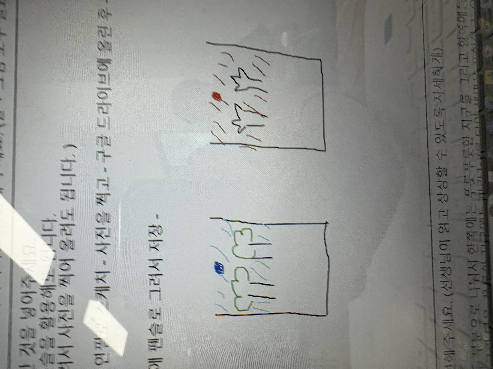
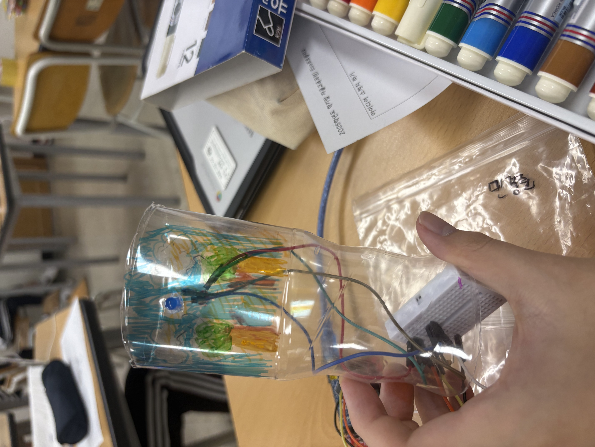

# 🌱 에코아트 프로젝트: [지구]

## 📖 프로젝트 개요
- **제작자**: [21113 민경준]
- **제작일**: [7/16]
- **소개**
저의 작품은 지구의 환경 오염과 생태계 파괴 문제의 심각성을 알리고 우리의 행동에 따라 지구가 변화활 수 있다는 메시지를 담고 있다.

## 📦 사용 재료
- 아두이노, 온도센서, LED, 브레드보드
- 페트병, 그림 도안 등

## 🔧 제작 과정

### 1단계: 아이디어 스케치

- 페트병을 두 부분으로 나눠서 한쪽에는 푸릇푸릇한 지구를 그리고 한쪽에는 오염된 지구를 그린 다음, 푸릇한 지구에는 파란 led를 달아 생명을 표현하고, 오염된 지구에는 붉은 led를 달아 위험을 표현한다.
  

### 2단계: 완성품

## 💭 제작 후기
### 잘된 점
- 아두이노를 활용해 보드와 LED, 선들을 잘 연결해 잘 작동되게 하였고 재활용품을 사용해 환경에 대한 메시지를 더욱 효과적으로 전할 수 있었다.

### 아쉬운 점
- 배선의 배치가 복잡하여 작품의 완성도가 떨어져 보인다.

### 개선할 점
- 버튼을 눌러 led를 키고 끄는 방식으로 표현하면 더 좋을 것 같다.

### 내가 이미 알고 있었던 것
- 아두이노라는 프로그램은 알고있었다. 

### 새롭게 배운게 된 것
- 아두이노의 기본 프로그래밍과 에코 아트 작품에서 기술과 친환경적 메시지를 조화시키는 법을 배웠다.

### 더 알고 싶은 것
- 아두이노의 더욱 다양한 프로그래밍 방법과 더 다양한 친환경 작품, 재료 활용법들을 알고 싶다.

## 🌍 환경적 의미
- 이 작품은 led를 통해 지구의 생명과 죽음을 시각적으로 표현함으로써 지구의 현재 상태와 미래에 대한 경각심을 불러 일으킨다. 푸른색의 led는 지구의 생명을, 붉은색의 led는 지구의 죽음을 나타낸다. 이를 통해 지구의 환경이 지속되기 위해서는 우리의 작은 행동 하나하나가 중요하다는 것을 느끼게 해준다. 또한 우리의 행동에 따라 지구가 변화활 수 있다는 메시지를 담고 있다.
- 나는 인공지능 관련 직종을 꿈꾸고 있는데 인공지능 기술이 지구의 환경 문제를 해결하는 데 중요한 열쇠가 될 수 있다고 믿는다. 앞으로는 AI의 데이터 분석과 예측 능력을 활용해 환경 변화를 더 정확히 이해하고, 지속 가능한 해결 방안을 찾아내는 데 기여하고 싶다. 내 작품처럼 기술과 예술이 만나 환경의 소중함을 전할 수 있듯, AI도 인간의 창의력과 결합해 더 혁신적이고 실질적인 환경 보호 방안을 만들 수 있다고 생각한다. 환경과 기술이 조화롭게 공존하는 미래를 설계하고, 작은 일상 속에서도 환경을 위한 선택을 통해 지구를 지키는 데 앞장서고 싶다.

## 🏷️ 태그
#에코아트 #재활용 #환경보호 #DIY #창의활동

